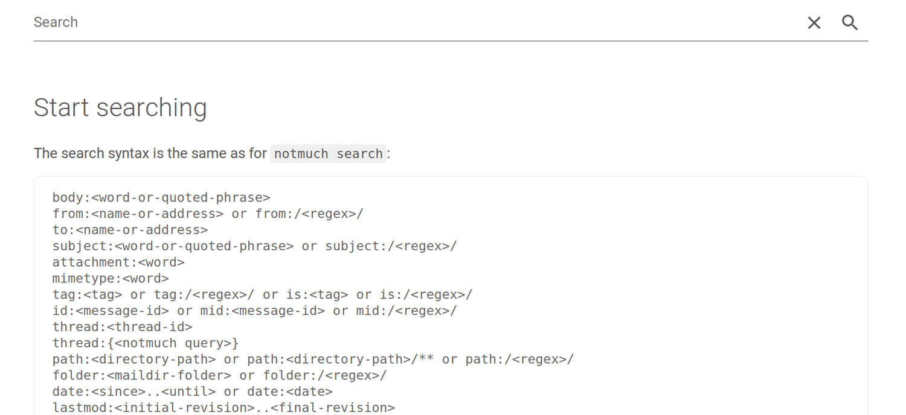

# net viel

net viel [nɛt fiːl] ([Swabian](https://en.wikipedia.org/wiki/Swabian_German) for "not much") allows searching through an e-mail archive indexed with [`notmuch`](https://notmuchmail.org/) from a browser.

The original idea (of which it falls way short) was to search e-mails in a local Maildir with the convenience of a GMail-like interface.

Technically, it is a single-page web app (based on the [Open WC Starter App](https://github.com/open-wc/open-wc-starter-app)) with a Python REST API as backend served with [Flask](https://palletsprojects.com/p/flask/).

## Installation

```
python3 -m pip install netviel --user
```

## Screenshots



(Nonsensical e-mails generated with the help of [Faker](https://github.com/joke2k/faker).)

## Demo

[See here for a demo instance](https://glacial-castle-83891.herokuapp.com/) with random e-mails (but no attachments or HTML e-mails, which net viel supports as well).

Note that the initial startup of the demo could take up to half a minute until the Heroku dyno (free tier) wakes up, after that it should be snappy.

## Requirements

You need to have `notmuch` installed with its Python bindings. On Debian-based systems, this is achieved with

```
sudo apt install notmuch python3-notmuch
```

Python 3.6 or above is required.

## Usage

The web interface accessing your local `notmuch` database is opened simply with
```
python3 -m netviel
```
The Flask default port 5000 can be changed with the `--ports` option.

**:warning: net viel is meant for *local* use only. Do *not* expose this to the Internet as-is. Bad things will happen! :warning:**


